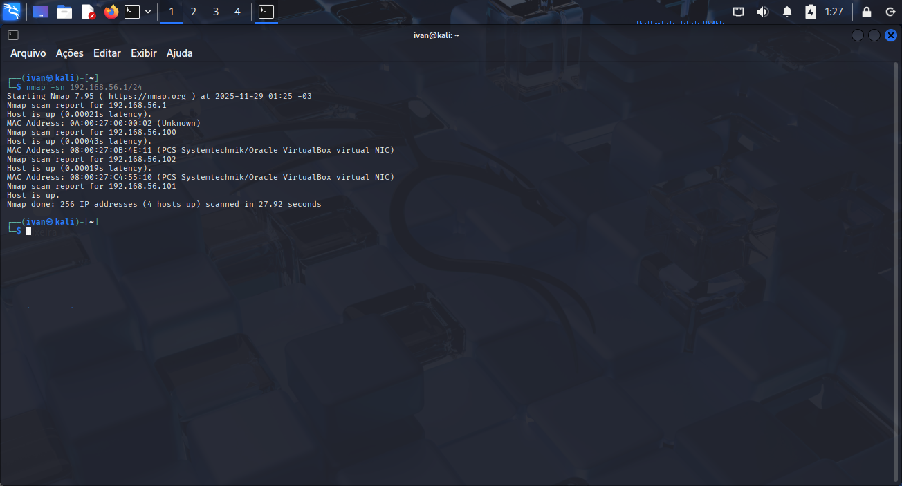
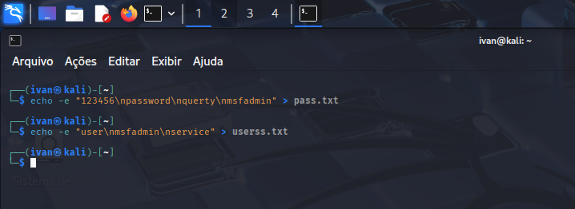

# Relatório de Exploração de Vulnerabilidade

---
 

  

---

<!--  -->
<table align="center">
<thead>
  <tr>
    <td>
        
Aluno

        <a href="https://github.com/marcelonascimento22">
         
      </a>
    </td>
    <td colspan="3">
    
 Estou me reinventando e iniciando minha carreira como Desenvolvedor, determinado a transformar minha paixão em resultados concretos e impacto positivo.
       
   
  

      
    </td>
  </tr>
</thead>
</table>

## 📌 1. Informações Gerais
**Título:** Relatório de Exploração de Vulnerabilidade  
**Projeto/Sistema:** Metasploitable 2 e DVWA  
**Cliente:** DIO  
**Responsáveis:** Ivan Rodrigues  
**Versão:** v1.0

##  2. Escopo e Regras de Engajamento
**Ambiente autorizado:**  
- Hosts/IPs: 192.168.56.102  
- Endpoints: Metasploitable 2 / VirtualBox

**Atividades:**  
- Varredura ativa  na rede
- Testes de intrusão controlados  
- Validação manual

##  3. Fases

- Reconhecimento do alvo
- Enumeração (buscar possiveis brechas no sistema)
- Análise
- Exploração 
- Evidências 
- Report

## 4. Ambiente usado
- Ambiente : Metasploitable 2 / VirtualBox

5. Ferramentas Utilizadas
- **arp-scan:** usado para descobrir todos os dispositivos ativos em uma rede local e mapear seus endereços IP e endereços físicos (MAC
- **Nmap:** serve para mapear redes, identificar dispositivos ativos e serviços, e auditar a segurança de sistemas
- **Medusa:** Ferramenta para realizar ataques de força bruta rápidos e eficientes contra diversos serviços de rede, como HTTP, FTP, SSH, Telnet, POP3, IMAP, VNC, entre outros 
- **enum4linux:** utilizada para a enumeração de informações em sistemas operacionais Windows e servidores Samba (SMB) em uma rede

  ## 📊 6. Resumo das Vulnerabilidades
| ID | Porta | Serviço| Vulnerabilidade | Severidade | Status | Observações | Versão|
|----|-------|--------|-----------------|------------|--------|-------------|-------|
| 01 | 21 | FTP | Brute Force | Crítica | Confirmada | Exposição de dados |2.3.4|
02 | 80 | HTTP | Brute Force | Crítica | Confirmada | Exposição de dados | apache httpd 2.2.8 ((ubuntu) DAV/2)
03 | 445 | SMB | Brute Force e Password Spraying | Crítica | Confirmada | Exposição de dados | SMBv1|

🕵️ 7. Vulnerabilidades detalhadas
### Exploração
**Coleta de informações relevantes:** 

**I -** Varredura da Rede com objetivo de descobrir ips que estão ativo nela.

  
Nesse caso ,temos 3 hosts ativos, 100,101 e 102  

**II -** Scaneando os serviços abertos no host alvo.

## Preparando o Ataque 
   Criação das WordLists

  
  1-Possiveis senhas e usuarios :
  
  
