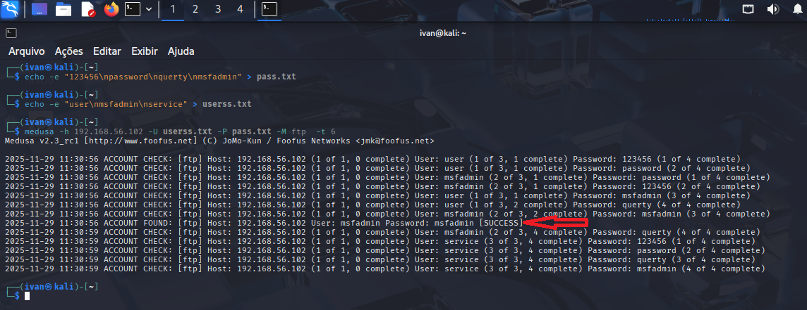
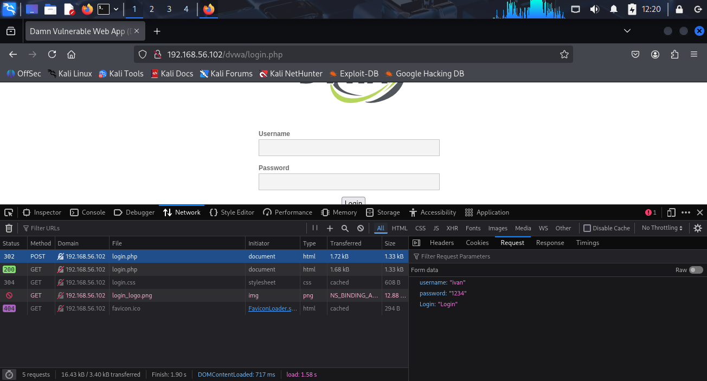
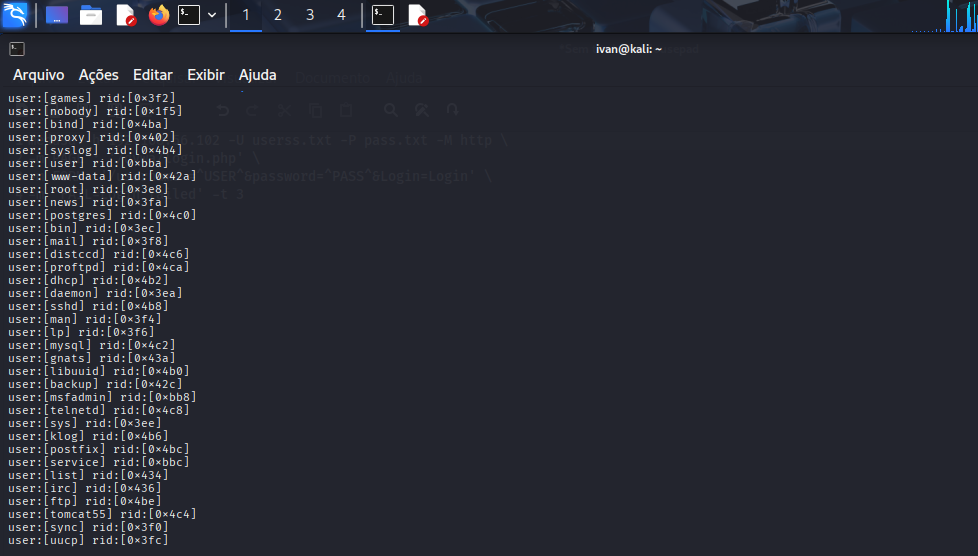
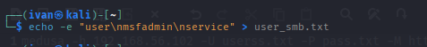
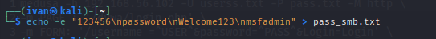
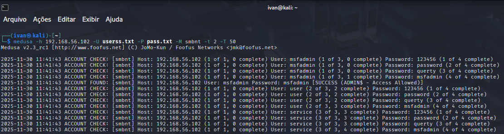
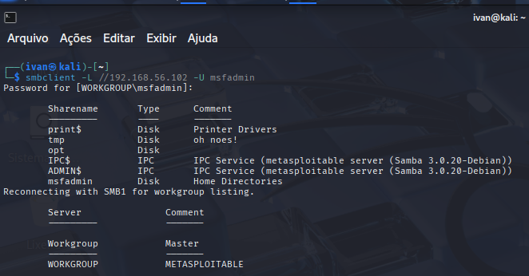
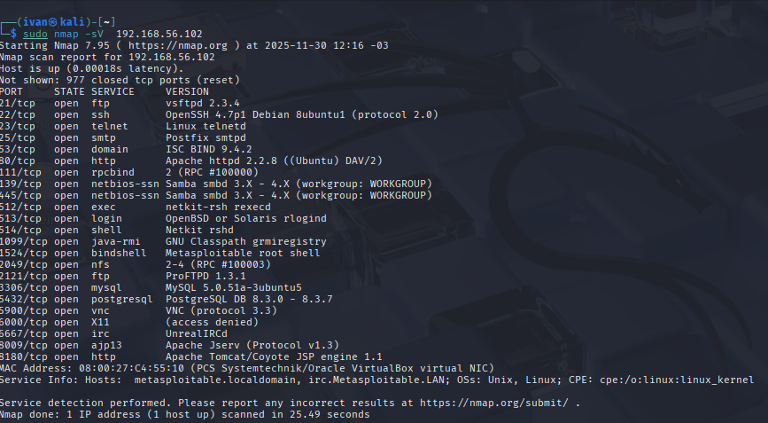

# Relatório de Exploração de Vulnerabilidade

---
 

  

---

<!--  -->
<table align="center">
<thead>
  <tr>
    <td>
        
Aluno

        <a href="https://github.com/marcelonascimento22">
         
      </a>
    </td>
    <td colspan="3">
    
 Estou me reinventando e iniciando minha carreira como Desenvolvedor, determinado a transformar minha paixão em resultados concretos e impacto positivo.
       
   
  

      
    </td>
  </tr>
</thead>
</table>

## 📌 1. Informações Gerais
**Título:** Relatório de Exploração de Vulnerabilidade  
**Projeto/Sistema:** Metasploitable 2 e DVWA  
**Cliente:** DIO  
**Responsáveis:** Ivan Rodrigues  
**Versão:** v1.0

## 2. Escopo e Regras de Engajamento
**Ambiente autorizado:**  
- Hosts/IPs: 192.168.56.102  
- Endpoints: Metasploitable 2 / VirtualBox

**Atividades:**  
- Varredura ativa  na rede
- Testes de intrusão controlados  
- Validação manual

##  3. Fases

- Reconhecimento do alvo
- Enumeração (buscar possiveis brechas no sistema)
- Análise
- Exploração 
- Evidências 
- Report

## 4. Ambiente usado
- Ambiente : Metasploitable 2 / VirtualBox

5. Ferramentas Utilizadas
- **arp-scan:** usado para descobrir todos os dispositivos ativos em uma rede local e mapear seus endereços IP e endereços físicos (MAC
- **Nmap:** serve para mapear redes, identificar dispositivos ativos e serviços, e auditar a segurança de sistemas
- **Medusa:** Ferramenta para realizar ataques de força bruta rápidos e eficientes contra diversos serviços de rede, como HTTP, FTP, SSH, Telnet, POP3, IMAP, VNC, entre outros 
- **enum4linux:** utilizada para a enumeração de informações em sistemas operacionais Windows e servidores Samba (SMB) em uma rede

  ## 6. Resumo das vulnerabilidades
| ID | Porta | Serviço| Vulnerabilidade | Severidade | Status | Observações | Versão|
|----|-------|--------|-----------------|------------|--------|-------------|-------|
| 01 | 21 | FTP | Brute Force | Crítica | Confirmada | Exposição de dados |2.3.4|
02 | 80 | HTTP | Brute Force | Crítica | Confirmada | Exposição de dados | apache httpd 2.2.8 ((ubuntu) DAV/2)
03 | 445 | SMB | Brute Force e Password Spraying | Crítica | Confirmada | Exposição de dados | SMBv1|

### Exploração
**Coleta de informações relevantes:** 

**I -** Varredura da Rede com objetivo de descobrir ips que estão ativo nela.

  
Nesse caso ,temos 3 hosts ativos, 100,101 e 102  

**II -** Scaneando os serviços abertos no host alvo.

## Preparando o Ataque 
   Criação das WordLists

  
  1-Possiveis senhas e usuarios :
  
  

  ## Vulnerabilidade 01 - Brute Force no serviço FTP
  *I -* Fazendo o uso da medusa para descobrir a possivel senha e usuário, nesse caso , usamos dois arquivos TXT. 
      
     
    **II-** Após rodar a linha de comando, onde está a seta vermelha , demonstra o usuário e senha achado naquele serviço FTP  
    **II.I-** A Descoberta chegou a o usuario :
       - msfadmin  
    **II.II-** A descoberta chegou a senha :
       - msfadmin

  **III-** Validando o acesso ao serviço FTP 
   

  **IV -** Exfiltração 
  
Caso tivesse algum arquivo dentro ,o atacante poderia gravar esses dados e ficar pra ele ,para isso ele teria que fazer um comando do tipo  **get dado_a_ser_pego.txt** 

### Vulnerabilidade 02 - Brute Force no servidor Web
**Descrição:** 
**I -** Analisando a Resquest do método POST e o retorno do login.
 

**II -** Realizando ataque novamente com a medusa e as word lists e analisando o resultado.

### Resultado 
  Podemos observar que o primeiro Sucesso foi dado com o valor do usuário igual a (admin) e a senha (password)
   

**III -** Validando o resultado do teste.
  

   ## Vulnerabilidade 03 - Brute Force no serviço de rede SMB
**Descrição:** 
**I -** Realizando a enumeração dos possíveis usuários.

     
 **I.I -** Lista de Usuários no sistema 
 
     

**II -** Criando uma nova word list com base na análise do resultado do Enum4linux.

- Lista de Usuarios:

 
- Lista de Senhas:

  
    
***III*** - Realizando o ataque com a ferramenta medusa e fazendo análise dos resultados do teste

  
  **Resultado:** Durante o teste , há uma saida do tipo  ***[SUCESS (ADMIN$ - ACESS ALLOWED) ]*** 
    *Com as credenciais em mãos , iremos fazer a validação. 

  **IV** - Validação das credenciais realizado com medusa 
  

## Detalhes futuros importante
  
A foto a seguir apresenta , além dos serviços que foram explorados , outros serviços que estão vulneráveis e que possivelmente alguns não são usados

   <b/>

  **Comando usado:**
                                                                       
                                      sudo nmap -sV 192.168.56.102

# Conclusão
-  De acordo com os testes realizados há vulnerabilidades nos serviços FTP e SMB
-  Portas abertas e versões antigas estão vulneráveis
-  portas usadas :21,445,139
-  credenciais muito fracas

# Impacto Real
-  O atacante tem total acesso a essas contas , podendo fazer mudanças do tipo credenciais,tomando a conta do usuário vítima
-  o atacante pode ter acesso a outras máquinas dentro dessa rede através de uma só maquina
-  Roubo de dados, o atancante pode fazer a exfiltração dos dados, gravando em sua maquina ou até mesmo criptografar os dados e pedir um valor em troca da senha pra descriptografar (ransomware)
-  Atraves da movimentação lateral , o atacante pode se mover dentro da rede entre os dispositivos até encontrar algo de maior valor
-  Interrupção dos serviços, como um Dos Local.
-  Tendo acesso a uma máquina , ele pode ter acesso a outras, podendo criar uma botnet 
-  Implementação de malwares dentro da rede
-  Upload via FTP não permitido , do tipo arquivos infectados
-  Envio de mensagens,email-s se passando pelos usuários (engenharia social)  e pegando informações, dados de cartoes,credenciais (pishing)
-  Vazamento dos dados , tornando um cenário inseguro,perdendo reputação no mercado,da marca ou da região
-  A perda dos pilares que seria Confidencialidade , integridade e disponibilidade dos serviços,maquinas

 # Métodos seguros a se fazer:
 - Uso de Captcha  para driblar bots
 - Uso da MFA para contas com privilégios altos
 - Uso de senhas mais fortes
 - Uso de firewall de proxima geração e Firewall de aplicação (WAF)
 - Uso de firewall e IPS (SIstema de prevenção de intrusão)
 - Bloqueio de N tentativas de login , podendo bloquear por tempo

# Recomendações de imediato 
- Atualizações de pacthes
- Verificar credenciais dos usuarios
- Ativar logs de atividades suspeitas
- Auditoria periodicas
- Headers de segurança
